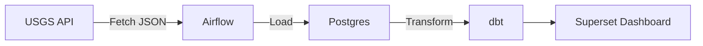
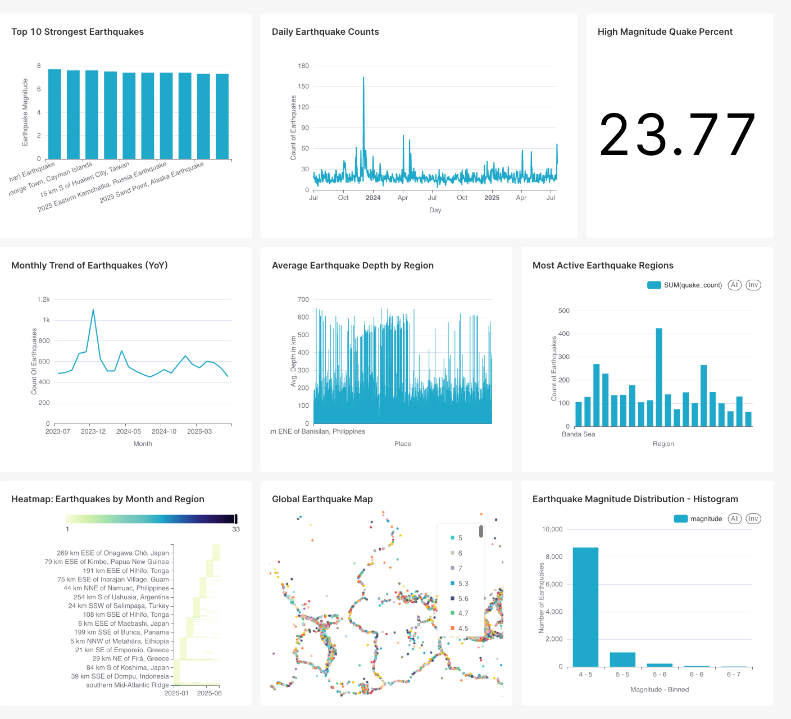

# Earthquake Data Pipeline with Airflow, dbt & Superset

This project is an end-to-end data pipeline that fetches real-time earthquake data from the [USGS Earthquake API](https://earthquake.usgs.gov/fdsnws/event/1/), processes it through Airflow, transforms it using dbt, and visualizes key insights through Apache Superset.
The dashboard helps monitor seismic activity, identify trends over time, and surface insights by region.

---

## 🚀 Project Overview

* **Source**: USGS Earthquake API (GeoJSON format)
* **Ingestion**: Apache Airflow (daily automated DAG)
* **Transformation**: dbt (data modeling + aggregations)
* **Storage**: PostgreSQL
* **Visualization**: Apache Superset (interactive dashboard)
* **Deployment**: Docker Compose

---

## 📦 Tech Stack

* **Apache Airflow** (LocalExecutor mode)
* **dbt (Data Build Tool)**
* **PostgreSQL**
* **Apache Superset**
* **Docker + Docker Compose**
* **Python 3.10**

---

## 🧱 Architecture



---

## 🧱 Repository Structure

```bash
├── dags         # Airflow DAGs
│   ├── dbt_run_dag.py
│   └── usgs_ingest_dag.py
├── dbt
│   ├── earthquake_dbt
│   │   ├── README.md
│   │   ├── analyses
│   │   ├── dbt_project.yml
│   │   ├── macros
│   │   ├── models
│   │   │   ├── marts
│   │   │   │   ├── agg_daily_counts.sql
│   │   │   │   ├── agg_heatmap_region_month.sql
│   │   │   │   ├── agg_high_mag_percent.sql
│   │   │   │   ├── agg_magnitude_distribution.sql
│   │   │   │   ├── agg_top10_magnitude.sql
│   │   │   │   ├── avg_depth_by_region.sql
│   │   │   │   ├── global_quake_map.sql
│   │   │   │   ├── monthly_earthquake_trend.sql
│   │   │   │   ├── most_active_regions.sql
│   │   │   │   └── schema.yml
│   │   │   └── staging
│   │   │       ├── schema.yml
│   │   │       └── stg_earthquakes.sql
│   │   ├── package-lock.yml
│   │   ├── packages.yml
│   │   ├── seeds
│   │   ├── snapshots
│   │   └── tests
│   └── profiles.yml
├── dbt-docker        #(Optional) needed only if you want to spin up a standalone dbt container
│   └── Dockerfile
└── superset
    ├── charts_export      # (Optional) Superset chart yaml
    │   ├── Average_Earthquake_Depth_by_Region_7.yaml
    │   ├── Daily_Earthquake_Counts_2.yaml
    │   ├── Earthquake_Magnitude_Distribution_-_Histogram_10.yaml
    │   ├── Global_Earthquake_Map_1.yaml
    │   ├── Heatmap_Earthquakes_by_Month_and_Region_3.yaml
    │   ├── High_Magnitude_Quake_Percent_4.yaml
    │   ├── Monthly_Trend_of_Earthquakes_YoY_8.yaml
    │   ├── Most_Active_Earthquake_Regions_11.yaml
    │   └── Top_10_Strongest_Earthquakes_6.yaml
    ├── dashboard_export  # (Optional) Superset dashboard yaml
    │   └── Earthquake_Data_Analysis_1.yaml
    └── superset-init.sh        # Initialization script
├── docs
│   └── dashboard.jpg      # (Optional) Screenshots of the dashboard
├── fetch_usgs_data.py            # Data fetching and insertion logic
├── Dockerfile.airflow
├── Dockerfile.superset
├── docker-compose.yml
├── .env
└── README.md
```


---

## ⚙️ Setup Instructions

### 1. Clone the Repo

```bash
git clone https://github.com/jazz-min/earthquake-data-pipeline.git
cd earthquake-data-pipeline
```

### 2. Set Environment Variables

Create a `.env` file in the root directory with the following variables:

```env
# Postgres DB / dbt DB
DB_NAME=earthquake_db
DB_USER=earthquake_user
DB_PASS=earthquake_pass
DB_HOST=postgres
DB_PORT=5432
DB_SCHEMA=transformed_data


# pgAdmin UI
PGADMIN_EMAIL=admin@example.com
PGADMIN_PASSWORD=admin123


# Airflow Admin
AIRFLOW_ADMIN_USERNAME=admin
AIRFLOW_ADMIN_PASSWORD=admin
AIRFLOW_ADMIN_FIRSTNAME=Admin
AIRFLOW_ADMIN_LASTNAME=User
AIRFLOW_ADMIN_EMAIL=admin@example.com

# Superset DB (Postgres for Superset metadata)
SUPERSET_DB_USER=superset_user
SUPERSET_DB_PASSWORD=superset_pass
SUPERSET_DB_NAME=superset_db
SUPERSET_DB_HOST=superset-db
SUPERSET_DB_PORT=5433


# Superset Admin User
SUPERSET_ADMIN_USERNAME=admin
SUPERSET_ADMIN_PASSWORD=admin
SUPERSET_ADMIN_FIRSTNAME=Superset
SUPERSET_ADMIN_LASTNAME=Admin
SUPERSET_ADMIN_EMAIL=admin@example.com

SUPERSET_SECRET_KEY="your super random secret key"


```

### 3. Start Services and initialize airflow

```bash
docker compose build
docker compose run airflow-init
docker compose up -d
```
Wait for a few seconds/minutes for all services (Airflow, Postgres, Superset) to be fully available


### 5. Initialize Superset (if not already)

```bash
docker exec -it superset /bin/bash /app/superset-init.sh
```

---

## 📊 Superset Dashboard

The dashboard includes the following visualizations:

| Chart Title                           | Chart Type   | Description                           |
| ------------------------------------- | ------------ | ------------------------------------- |
| 🌍 Global Earthquake Map              | Scatter Plot | Location of all earthquakes           |
| 📅 Daily Earthquake Counts            | Line Chart   | Daily volume trend                    |
| 🔁 Monthly Earthquake Trend (YoY)     | Line Chart   | Monthly comparison                    |
| 📏 Magnitude Distribution             | Histogram    | How frequent different magnitudes are |
| 🥇 Top 10 Strongest Earthquakes       | Bar Chart    | Based on magnitude                    |
| 🔥 Most Active Regions                | Bar Chart    | Top earthquake-prone regions          |
| 🌡️ Heatmap: Month vs Region          | Heatmap      | Seasonality by location               |
| ⛏️ Average Earthquake Depth by Region | Bar Chart    | Avg. depth by place                   |

---


### 4. Access UIs

* Airflow: [http://localhost:8081](http://localhost:8081)
* Superset: [http://localhost:8089](http://localhost:8089)
* pgAdmin: [http://localhost:8080](http://localhost:8080)

---

## 📥 Import Dashboard into Superset

Import using the Superset CLI:

```bash
docker exec -it superset superset import-dashboards \
   --path <path to dashboard zip file> \
  --username admin
```

Or via UI: **Settings > Import Dashboards**

---
## 📥 Export Dashboard From Superset
```bash
docker exec -it superset superset export-dashboards -f /tmp/dashboard_export_$(date +%Y%m%dT%H%M%S).zip
docker cp superset:/tmp/dashboard_export_$(date +%Y%m%dT%H%M%S).zip .
```

## 🔁 Trigger Historical Backfill (Optional)

To load more historical data:

```bash
docker exec -it airflow-webserver airflow dags trigger usgs_earthquake_etl \
  --conf '{"start_date": "2023-01-01", "end_date": "2024-12-31", "min_magnitude": 4.5}'
```

---

## 💡 Key Learnings & Highlights

* Hands-on ETL using Airflow's PythonOperator
* Data modeling and transformation using dbt
* Dashboard building and filtering in Superset
* Dockerized, local-first development workflow

---

## 📸 Sample Dashboard Screenshot



---

---

## ✅ Sample CLI Commands

### Run Airflow scheduler:

```bash
docker exec -it airflow-scheduler airflow scheduler
docker exec -it airflow-webserver airflow dags list

```

### Test dbt models:

```bash
docker exec -it airflow-webserver dbt run
docker exec -it airflow-webserver dbt debug

```
### To build dbt docker image compatible with Mac M1:
```bash
 docker build --platform linux/arm64 dbt-postgres-arm64 .
```

## 📌 Future Enhancements

* Add unit tests for data validation
* Automate dbt tests and Superset dashboard publishing
* Add GitHub Actions CI for DAG syntax & dbt checks

---


## 📝 License

MIT License

---

## 🙌 Acknowledgments

* [USGS Earthquake API](https://earthquake.usgs.gov/fdsnws/event/1/)
* Apache Airflow, dbt, Superset


